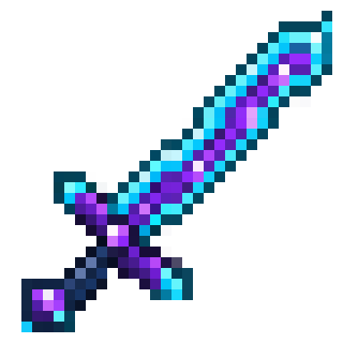
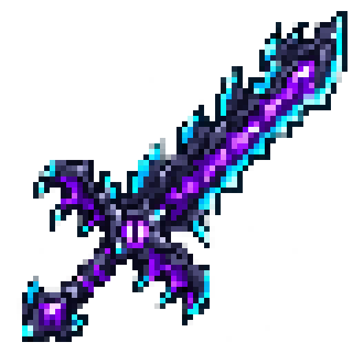

# 十三契刃 / Thirteen Blade

当前版本 **0.4.0**。新增两把不可损坏的成长剑、灵魂吞噬、随机强化怪物和独立剑灵对话框。提供 **Fabric / Minecraft 1.20.1 / Java 17** 与 **NeoForge / Minecraft 1.21.1 / Java 21** 两个版本。客户端和服务器均需安装对应版本。

开源协议：[MIT License](LICENSE)。首次开发可读 [模组开发入门](docs/MOD_DEVELOPMENT_GUIDE.md)；源码结构见 [文件树与职责](docs/PROJECT_STRUCTURE.md)。





## 安装与合成

- Fabric：安装 Fabric Loader 0.16.14+、Fabric API 0.92.2+1.20.1，将 `build/libs/thirteen-blade-0.4.0.jar` 放入实例的 `mods/`。
- NeoForge：安装 NeoForge 21.1.251+，将 `neoforge-1.21.1/build/libs/thirteen-blade-neoforge-1.21.1-0.4.0.jar` 放入 `mods/`。无需 Fabric API，详见 [该版本说明](neoforge-1.21.1/README.md)。
- 更新时移出旧版 JAR；不要安装 `-sources.jar`。旧剑击杀数和能力继续保留，原蜘蛛「缓降」刻印自动按「隐身」生效。
- 基础剑：工作台中间一列从上到下为 **紫水晶碎片 → 下界合金剑 → 末影珍珠**。普通配方不继承原下界合金剑的附魔、名称和耐久。
- 进阶剑「龙契·十三刃」：**十三契刃 + 龙蛋**，无序合成，可使用 2×2 合成栏。消耗龙蛋；继承原剑的全部自定义数据，包括击杀、刻印、抢夺效果、附魔、名称、身份、冷却和剩余黄心。进阶剑不能再次升级。

```mcfunction
/give @s thirteenblade:thirteen_blade
/give @s thirteenblade:dragon_thirteen_blade
```

| 操作 | 默认按键 |
| --- | --- |
| 准备 / 取消下一次吞噬 | V |
| 独立剑灵对话框 | J |
| 发送 / 返回游戏 | Enter / Esc |
| 翻阅对话、左侧属性 | 鼠标放到相应区域滚动 |

按键可在设置中修改。主手、副手都支持技能、刻印和成长攻击，双手都有剑时主手优先；生命加成只要求剑在物品栏。对话窗口不暂停游戏。

## 成长与携带规则

| 属性 | 十三契刃 | 龙契·十三刃 |
| --- | --- | --- |
| 初始主手攻击 | 6 | 12 |
| 攻击速度 | 1.6 次/秒 | 1.6 次/秒 |
| 成长 | 每 13 次有效击杀 +2 攻击、+2 最大生命 | 相同 |
| 成长上限 | **10 级**，累计 +20 攻击、+20 生命 | 无模组等级上限 |
| 130 次击杀时 | 26 攻击、玩家 40 生命 | 32 攻击、玩家 40 生命 |
| 1300 次击杀时 | 仍按 10 级生效 | 100 级，212 攻击、玩家 220 生命 |

表中未计附魔和其他来源。基础剑封顶后仍记录击杀，升级立即解锁已积累的等级。原版伤害计算仍生效；取消的是进阶剑的成长等级上限，原版属性数值边界仍存在（最大生命 1024，攻击 2048）。击杀计数防止整数溢出，最多记录 2,147,483,647 次。

- 两把剑均不消耗耐久，掉落物防火；仍可能掉进虚空或按掉落物规则消失。
- 有效击杀要求玩家直接近战击杀成年生物；不计算玩家、村民、已驯服宠物、幼年生物和箭矢等间接伤害。
- 攻击成长和韧性要求任一手持剑，双持不叠加。副手持剑时，原版主手物品仍决定基础攻击和攻击速度，服务器额外应用生效剑的成长攻击；不会凭副手剑替换主手物品的原版攻击属性。
- 快捷栏、普通背包格或副手中的剑提供生命，多把取最高值，不相加。不读取箱子、末影箱或潜影盒内部。携带不会直接回血；移除时截断超过新上限的当前生命。
- 每首次吞噬一种敌对生物，剑增加 **2 点盔甲韧性**。列出的同族变种只算一类；未列出的敌对物种（例如恶魂）按实体类型计数，也能提供韧性。普通击杀不增加韧性，重复吞噬不重复增加。
- 韧性独立于基础剑 10 级成长封顶。为让 16 类合计 32 点真正生效，将原版韧性属性的数值上限由 20 放宽到 1024；没有凭空增加其他实体的韧性。

## V：触发式灵魂吞噬

按 V 进入准备状态，**没有 30 秒倒计时，也不立即扣冷却**。下一次有效近战击杀消耗机会、吸收能力，并从该次触发起进入 **60 秒冷却**。再次按 V 可免费取消；收剑、更换生效剑、死亡、旁观或离线会取消准备。同一把剑在主副手之间交换可以保留准备。一次横扫最多吞噬一个目标。冷却按现实时间保存在剑上，离线继续流逝。

| 吞噬目标 / 家族 | 固有能力 |
| --- | --- |
| 僵尸类（含尸壳、溺尸、僵尸村民等） | 免疫饥饿负面效果 |
| 骷髅类（含流浪者、凋灵骷髅；1.21.1 含沼骸） | 夜视 |
| 蜘蛛、洞穴蜘蛛 | 隐身 |
| 苦力怕 | 伤害吸收 I，4 点黄心生命 |
| 烈焰人 | 抗火 |
| 凋灵 | 生命恢复 I |
| 末影龙 | 创造式飞行（双击跳跃起飞，不切换游戏模式） |
| 掠夺者 | 村庄英雄 V（原版正常最高等级） |
| 幻翼 | 迅捷 I |
| 女巫 | 急迫 I |
| 史莱姆、岩浆怪 | 跳跃提升 I |
| 卫道士 | 成功近战命中附加 5 秒虚弱 I |
| 守卫者、远古守卫者 | 水下呼吸 |
| 监守者 | 免疫失明和黑暗 |
| 潜影贝 | 饱和 I |
| 旋风人（仅 NeoForge 1.21.1） | 抗性提升 I |

Fabric 仍为 1.20.1，原版没有旋风人，因此该版无法自然吞噬此物种。其余列出的物种可正常获取对应能力。

固有能力永久记录在剑上。目标的持续正面药水效果也会同时被抢夺，默认无限时长；瞬间治疗、伤害与负面效果不抢夺。同效果取最高等级，抢夺效果默认最高 III，固有村庄英雄 V 不受此上限影响。普通有效目标也可以提供身上的增益。没有可吸收能力的有效击杀仍会消耗准备并进入冷却。

收剑后，剑提供的药水效果保留 **100 游戏刻（通常约 5 秒）**；飞行权限同样最多保留约 5 秒。饥饿 / 失明 / 黑暗免疫和附加虚弱属于持剑规则，收剑立即停止；原版药水、信标等外部效果优先，不会在收剑时被删除。死亡、旁观、离线立即清理剑提供的能力。饥饿免疫不阻止跑步消耗饱食度；隐身仍遵循原版盔甲可见性规则。

黄心会正常消耗，刷新、换剑、喝奶和重登不能补满；剩余值跟随每把剑保存。再次技能击杀苦力怕或带伤害吸收的目标可补满。喝奶能清除当前药水效果，继续持剑会恢复刻印，但不会恢复已消耗黄心。

## 随机强化怪物

- 新自然生成 / 区块初始生成的成年敌对生物，默认 **5%** 概率成为强化怪物。不额外提高总刷怪数量。
- 生命上限提高到原来的 **1.5 倍**，随机获得 **1～2 种**永久增益，通常为 I～II 级。
- 效果池：速度、力量、抗性提升、生命恢复、抗火、伤害吸收。抗火固定 I 级。
- 强化怪物带发光轮廓和药水粒子，沿用原版模型和 AI，仍按原版规则自然消失。
- 刷怪笼、刷怪蛋、命令生成、幼年怪物、凋灵、末影龙和监守者不参与此随机强化。
- 每个自然生成的怪物只判定一次，保存重载不重新抽取，也不重复增加生命。
- 这是怪物生成规则改动，不是地形生成改动。在旧存档的已探索区域，新刷出的自然怪物同样可能强化；已存在的怪物不会被批量改造。

## 与剑灵对话

J 打开的窗口完全独立于多人聊天。默认是离线关键词回应，可以询问「你是谁」「如何吸收」「成长」「饥饿」。这不是本地大模型。

API 模式支持 **Chat Completions 兼容协议**，例如提供该接口的云服务或本机模型服务。接口格式参考 [Chat Completions 文档](https://api-docs.deepseek.com/api/create-chat-completion/)。第一版使用非流式响应。

首次启动客户端后，编辑游戏实例内的 `config/thirteenblade-chat.json`（开发运行时位于 `run/config/`）：

```json
{
  "enabled": true,
  "endpoint": "https://你的服务域名/v1/chat/completions",
  "model": "填写服务商实际提供的模型名",
  "apiKeyEnvironmentVariable": "THIRTEEN_BLADE_API_KEY",
  "apiKey": "",
  "timeoutSeconds": 30,
  "maxTokens": 240,
  "temperature": 0.8
}
```

- `endpoint` 是完整接口地址，程序不会自动添加路径。云服务要求 HTTPS；本机 `localhost`、`127.0.0.1`、`[::1]` 可使用 HTTP，例如 `http://localhost:11434/v1/chat/completions`。
- 推荐在本机环境变量中设置 `THIRTEEN_BLADE_API_KEY`，然后重新启动游戏 / 启动器。也可以在本机 JSON 的 `apiKey` 字段填写密钥；不要分享含密钥的配置文件。环境变量优先于 JSON。
- 不需要认证的本机服务可以留空密钥。配置中的示例域名和模型名只是占位，不会默认连接任何真实服务。
- 保存后重新打开 J 窗口，或点击「读取配置」。配置无效时退回离线模式；网络或服务异常时给出提示并使用离线回应。
- 只有玩家点击发送才调用 API，每次发送最多 512 字符，同一把剑同时仅一个请求，并有 1.5 秒发送间隔。
- 外发内容为当前剑的属性、最近至多 20 条对话及剑灵设定；不发送玩家姓名、坐标、服务器地址或多人聊天。使用服务商 API 可能按其规则计费。
- 密钥不写入剑的 NBT、不发给游戏服务器、不写入日志。对话仅保存在本次连接的客户端内存里，按剑区分；断开世界清空，最多保留 16 把剑的会话。
- API 只产生文字，不执行游戏命令、改变属性或生成物品。

## 修改数值

编辑游戏 / 服务器实例内的 `config/thirteenblade.json`，然后重新启动。单机使用本机配置，多人服以服务器配置为准并同步到客户端。

```json
{
  "killsPerLevel": 13,
  "damagePerLevel": 2.0,
  "healthPerLevel": 2.0,
  "absorptionCooldownSeconds": 60,
  "eliteSpawnChance": 0.05,
  "eliteHealthMultiplier": 1.5,
  "eliteMaxEffects": 2,
  "eliteMaxEffectLevel": 2,
  "maxStolenEffectLevel": 3,
  "stolenEffectDurationSeconds": -1
}
```

修改升级阈值或每级加成后，会按原有击杀数重新计算成长，不删除击杀记录。当前程序对配置数值设置合理范围，避免负值、无限值或除零错误。

`eliteSpawnChance` 范围为 0～1，0 关闭强化，1 代表符合条件的新怪物必定强化。`stolenEffectDurationSeconds = -1` 表示新夺取的增益永久保留；正整数表示从抢夺成功起的现实秒数，离线及收剑也继续计时。修改时长只影响之后的抢夺，已存的永久效果不追溯缩短。固定的物种刻印不受这个时长选项影响。旧版配置缺失的新字段自动采用默认值，可以手动将这些字段加入原 JSON。

## 构建与开发

以下命令构建 Fabric 版。NeoForge 1.21.1 使用 **JDK 21**，进入 `neoforge-1.21.1/` 后运行该目录的 Gradle Wrapper；具体命令见 [NeoForge 说明](neoforge-1.21.1/README.md)。两个加载器的 JAR 不能混装，客户端与服务器须使用同一加载器、游戏版本和模组版本。两个项目是独立构建，不支持直接把 Fabric 1.20.1 世界转换成 NeoForge 1.21.1 世界。

在项目根目录使用 JDK 17：

```powershell
.\gradlew.bat --gradle-user-home .gradle-user-home build
.\gradlew.bat --gradle-user-home .gradle-user-home runClient
```

macOS / Linux 可使用 `bash ./gradlew --gradle-user-home .gradle-user-home build`。首次运行需要下载 Gradle、Minecraft 和 Fabric 依赖；客户端运行还需下载游戏资源。

构建输出为 `build/libs/thirteen-blade-0.4.0.jar`。项目固定使用 Gradle 8.7、Loom 1.6.12、Yarn 1.20.1+build.10、Loader 0.16.14、Fabric API 0.92.2+1.20.1。

主要入口：

- `src/main/java/dev/thirteenblade/BladeGameplay.java`：服务器击杀、吸收、属性及同步。
- `src/main/java/dev/thirteenblade/BladeData.java`：每把剑的持久化状态。
- `src/main/java/dev/thirteenblade/BladeInventory.java`：主副手选择、物品栏最高生命加成。
- `src/main/java/dev/thirteenblade/BladeEffects.java`：效果归属、收剑 5 秒余效、外部药水兼容、黄心保存。
- `src/main/java/dev/thirteenblade/EliteMobs.java`：新自然怪物的概率强化。
- `src/client/java/dev/thirteenblade/client/SwordChatScreen.java`：客户端对话界面。
- `src/main/java/dev/thirteenblade/chat/ChatTransport.java`：异步 API 传输和响应限制。
- `src/main/resources/assets/thirteenblade/lang/`：简体中文及英文。
- `src/main/resources/assets/thirteenblade/textures/item/thirteen_blade.png`：32×32 透明贴图。

自动测试与尚需人工验证的内容见 [验收清单](docs/TESTING.md)。

## 美术

0.4.0 新增「龙契·十三刃」：龙翼护手、黑曜石尖刺、紫色剑芯和青色刃缘，沿用原剑配色。进阶贴图使用 imagegen 基于原剑参考图生成，按授权整理为 64×64 透明 PNG，未提取其他游戏素材。

内置 imagegen 生成钻石剑轮廓、紫青色泰拉瑞亚风格的原创像素剑，再用最近邻采样整理成 32×32 游戏贴图。没有提取或打包泰拉瑞亚原版材质。

原图、像素预览、生成提示词分别见 `docs/art/sword-source.png`、`docs/art/sword-preview.png`、[美术记录](docs/art/PROMPT.md)。

## 开源协议

本项目的原创源码、文档和美术资源采用 [MIT License](LICENSE)：允许使用、修改、分发及商用，分发副本或实质性部分时须保留版权声明和许可声明。软件按原样提供，不作担保。正式条款以 `LICENSE` 中的英文全文为准。

第三方组件（例如 Gradle Wrapper、Minecraft、Fabric 和 NeoForge 相关依赖）遵循各自的许可证，本项目的 MIT 声明不替代它们的许可条款。
