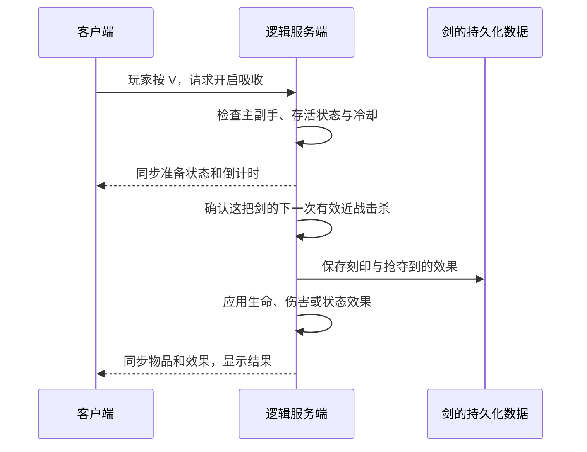

# 从「十三契刃」理解 Minecraft 模组开发

> 本文以 Fabric 1.20.1 的基础架构讲解为主。0.4.0 已扩展为两把剑，并在 `neoforge-1.21.1/` 提供独立的 NeoForge 实现；最新配方、上限和能力规则以 [README](../README.md) 为准。

本文以本项目的 **Minecraft Java 1.20.1 + Fabric + Java 17 + Yarn 映射**为准。先理解每部分负责什么，再看具体类名，比一开始背 API 更有用。不同 Minecraft 版本的 API、资源格式和物品数据结构会变，照着其他版本教程复制代码，可能无法编译。

## 1. 模组到底是什么

模组是由加载器接入 Minecraft 的扩展程序。本项目最终生成一个 JAR，里面包含编译后的 Java 类、模组元数据、模型、贴图、语言文件、配方等。

运行时大致是：

```text
启动器启动 Minecraft + Fabric Loader
→ Loader 发现 mods 文件夹里的 JAR
→ 读取 fabric.mod.json，检查版本和依赖
→ 接入声明的代码入口及 Mixin
→ 注册物品、加载资源、安装事件监听
→ 游戏运行时触发击杀、按键、刷怪等逻辑
```

这里有几个容易混淆的工具：

| 名称 | 用途 | 玩家是否需要另外安装 |
| --- | --- | --- |
| Minecraft | 游戏本体，提供世界、玩家、物品等基础系统 | 需要 |
| Fabric Loader | 发现、加载模组并提供加载基础设施 | 需要 |
| Fabric API | 通用事件、网络、物品栏等开发接口集合 | 本项目需要放进 mods |
| Java / JDK | 运行 Java 程序；JDK 还提供编译工具 | 开发需要 JDK，启动器可能自带运行环境 |
| Gradle | 下载依赖、编译、测试、打包 | 本项目提供 Wrapper，开发者无需单独装 Gradle |
| Fabric Loom | 配置 Minecraft 开发环境及发布时映射处理的 Gradle 插件 | 构建时自动下载 |
| Yarn | 把这版 Minecraft 的混淆名称映射成便于阅读的名称 | 构建依赖，玩家无需手动安装 |

`gradlew.bat` 是构建工具的启动脚本，不是游戏模组；发布 JAR 也通常不是双击运行的应用程序。Loom 的具体职责可参考 [官方 Loom 说明](https://docs.fabricmc.net/develop/loom/)。

## 2. 一个模组通常包含哪些部分

并非每个模组都需要 GUI、网络包或 Mixin。功能决定结构。例如只改贴图可能用资源包就够了，带成长、技能和对话的剑就需要更多模块。

| 部分 | 解决的问题 | 本项目中的对应文件 |
| --- | --- | --- |
| 模组说明 | 我是谁？版本是什么？依赖什么？入口在哪？ | `src/main/resources/fabric.mod.json` |
| 公共初始化 | 启动时注册物品及事件 | `ThirteenBlade.java` |
| 物品定义 | 剑的材质、攻击速度、耐久和提示 | `ThirteenBladeItem.java` |
| 游戏规则 | 怎样计杀、升级、启动吸收及判定奖励 | `BladeGameplay.java` |
| 携带与持剑判定 | 主副手谁生效，背包中的哪把剑提供生命 | `BladeInventory.java` |
| 持久化数据 | 退出游戏后，怎样记住每把剑的状态 | `BladeData.java` |
| 状态效果管理 | 怎样区分剑的效果与真实药水、处理收剑及黄心 | `BladeEffects.java` |
| 怪物强化 | 哪些新怪物抽取强化，给什么属性和效果 | `EliteMobs.java` |
| 客户端入口 | 注册 V/J 按键、HUD、客户端收包 | `src/client/.../ThirteenBladeClient.java` |
| 界面 | 对话框、输入框、按钮、文字滚动 | `SwordChatScreen.java` |
| 外部服务 | API 请求、超时、响应解析 | `ChatTransport.java` |
| 客户端资源 | 贴图、模型、翻译 | `assets/thirteenblade/` |
| 游戏数据资源 | 合成配方、进度；以后可放掉落表等 | `data/thirteenblade/` |
| 配置 | 数值平衡、API 地址等 | `BalanceConfig.java`、`ChatSettings.java` |
| 构建及测试 | 生成可安装文件，验证逻辑 | `build.gradle`、`src/test/`、`src/gametest/` |

`ThirteenBlade.java` 等公共类的完整位置是 `src/main/java/dev/thirteenblade/`。客户端类放在 `src/client/java/dev/thirteenblade/client/`。这是本项目选择的组织方式，不是要求所有模组都使用这些文件名。[Fabric 项目结构说明](https://docs.fabricmc.net/develop/getting-started/project-structure)解释了源码与资源目录的基本分工。

## 3. Item 和 ItemStack：一类物品与一把具体的剑

注册表记录游戏中的“种类”。原版钻石剑的标识是 `minecraft:diamond_sword`，本模组的剑是 `thirteenblade:thirteen_blade`。冒号前是命名空间，后面是名称，避免不同模组都叫 `sword` 时互相冲突。

在 `ThirteenBlade.java` 中，我们把一个 `ThirteenBladeItem` 实例注册进物品注册表。这个 `Item` 描述所有十三契刃共有的行为；玩家背包里实际拿着的是 `ItemStack`，每个堆叠可有自己的数据。[Fabric 注册表说明](https://wiki.fabricmc.net/tutorial:registry)可以帮助理解这个机制。

例如两把剑：

```text
剑 A：Item 类型 = thirteenblade:thirteen_blade
      ItemStack 数据 = 39 次击杀、夜视、速度 II

剑 B：Item 类型 = thirteenblade:thirteen_blade
      ItemStack 数据 = 0 次击杀、无刻印
```

不能把击杀数直接放成 `ThirteenBladeItem` 上一个所有实例共用的普通字段，否则两把剑可能共用计数。我们把击杀数、刻印、抢夺效果和剩余黄心写在各自 `ItemStack` 的 NBT 中。

NBT 是 Minecraft 用来保存结构化数据的格式，可以理解为带明确数据类型的键值集合。本项目没有为每把剑创建独立文本文件，而是让数据随物品进入原版存档与库存同步流程。

“保存”和“同步”还不是一回事：保存解决下次进入游戏能否恢复，同步解决另一端此刻是否知道最新状态。库存 NBT 可以利用原版同步；按下 V 的请求、技能倒计时、服务器平衡设置则有专门的数据包。

## 4. 客户端和服务端分别负责什么

先按职责理解：客户端负责接收输入、显示世界和界面；服务端负责权威游戏状态，例如实际伤害、怪物生成、物品获得和存档。客户端也会预测或模拟一些行为，使画面流畅，但关键结果仍由服务端决定。

**单人游戏也存在服务端。** 当你打开一个单人世界，游戏客户端进程内会启动一个集成服务器。局域网联机也使用这个集成服务器；独立服务器则运行在单独进程里。因此，需要区分“运行哪个程序的物理端”和“代码执行什么职责的逻辑端”。[Fabric 客户端 / 服务端说明](https://wiki.fabricmc.net/tutorial:side)

| 本项目行为 | 负责的逻辑端 | 原因 |
| --- | --- | --- |
| 检测键盘 V/J | 客户端 | 只有玩家的客户端有这些键盘输入 |
| 显示贴图、HUD、对话窗口 | 客户端 | 这是画面和交互表现 |
| 检查当前是否持剑、技能是否冷却 | 服务端 | 不能相信客户端直接声称“技能可用” |
| 判定击杀、增加伤害与最大生命 | 服务端 | 决定实际游戏结果 |
| 强化怪物、夺取效果 | 服务端 | 所有玩家应看到同一个怪物和奖励结果 |
| 保存剑的成长 | 服务端 | 世界和库存数据以服务端为准 |
| 请求剑灵文字 API | 本项目放在客户端 | 使用玩家自己的配置和密钥，只产生本地文字 |

技能的一次完整流程是：



客户端发送的是“请求使用技能”，而不是“给我力量 III”。后者会让修改过的客户端有机会自行决定奖励。网络处理后还要回到游戏主线程操作实体，本项目通过 `server.execute(...)` 完成。[Fabric 网络说明](https://docs.fabricmc.net/develop/networking)进一步解释了逻辑端之间的通信。

## 5. 为什么有的模组只装一边，有的两边都要装

这取决于功能需要哪一端理解新的代码和数据。

| 模组类型 | 典型例子 | 常见安装位置 |
| --- | --- | --- |
| 只处理客户端表现 | 本地 HUD、渲染调整、按键界面 | 客户端 |
| 只改变服务端规则，使用原版能表达的内容 | 调整刷怪规则、部分掉落规则、服务端管理指令 | 服务端；进入单人世界时则装在本地实例 |
| 新增真实注册物品、方块或实体 | 新剑、新机器、新生物 | 通常客户端与服务端都需要 |
| 服务端功能配合可选客户端增强 | 服务端提供功能，客户端额外显示操作界面 | 视协议设计而定 |

“服务端模组”不等于“只能玩多人”。只要它在集成服务器上执行逻辑，单人也可以用。相反，把整个 Fabric 模组的 `environment` 写成 `server` 是限制**物理运行环境**，可能使它不会在本地客户端进程中加载；这不能作为判断游戏逻辑端的替代方案。

本项目是双端模组：新增的剑、资源、快捷键和对话窗口需要客户端代码，成长与强化规则需要服务端代码。独立服务器不能加载 `MinecraftClient`、`Screen` 等客户端专用类，所以客户端源码单独存放。`src/main/java` 表示公共源码，**不等于只在服务端运行**；公共初始化入口同样会在物理客户端启动。

## 6. 新增物品、修改原版物品与世界生成的区别

| 目标 | 实际改了什么 | 常见实现方式 | 需要特别考虑 |
| --- | --- | --- | --- |
| 新增一把剑 | 新增一个独立物品种类及标识 | 注册 `Item`，定义类，加入模型、贴图、配方 | 双端识别、物品数据、保存兼容 |
| 修改所有钻石剑的攻击规则 | 修改 `minecraft:diamond_sword` 的现有行为 | 属性处理、事件，必要时 Mixin | 全部钻石剑受影响，容易与其他改同处的模组冲突 |
| 只修改钻石剑外观 | 资源显示变化 | 通常用资源包 | 不会因此改变服务端实际伤害 |
| 修改钻石剑配方 | 修改服务端的数据资源 | 数据包或模组内配方 JSON | 配方路径、重载与其他数据包覆盖关系 |
| 概率强化原版怪物 | 怪物刷出后，多一些属性和状态效果 | 生成钩子 + 服务端逻辑 | 生成原因、概率、不能在加载旧实体时反复抽奖 |
| 增加矿石、树木、地牢 | 改变区块生成内容 | 配置 / 放置特征、结构、群系规则和数据资源 | 生成分布、性能、世界种子、已有区块 |
| 改变山脉或增加维度 | 改变世界生成的基础规则 | 噪声、群系源、区块生成器、维度配置等 | 存档兼容和生成稳定性，复杂度通常更高 |

本项目继承 `SwordItem`，意味着复用原版剑的通用行为，再注册一个新的类型；它不会把游戏里所有钻石剑都改成十三契刃。合成时钻石剑只是输入材料。

修改原版物品也不总要“改 Java 代码”。只改配方、掉落、标签等现成数据驱动的内容，往往用 JSON 即可；要加入原版没有的行为，才可能需要事件或 Mixin。新增功能也不一定比修改原版更复杂：新增一把简单剑有清晰的独立入口，修改所有剑的某个底层计算反而需要理解更多原版流程。

生成矿石或地形的变动通常作用于**之后新生成的区块**，旧区块不会自动重建。若想往旧区块补矿，需要专门的回填逻辑，并考虑已建建筑和玩家开采痕迹。当前的强化怪物功能不重建区块，只处理新自然刷出的怪物，因此已探索区域也能遇到新强化怪物。

## 7. 资源包、数据包、模组和插件

在选实现方式前，先看游戏是否已经支持你需要的内容。

- **资源包**：主要改变贴图、模型、声音、语言等客户端表现，不能单凭一张更大的剑贴图提高服务器伤害。
- **数据包**：利用游戏已有的数据系统，例如配方、掉落表、标签、函数、进度及支持的数据化世界生成。对于 1.20.1，不能把任意 Java 类塞进数据包，就得到一种新的注册物品或 GUI。
- **Fabric 模组**：可以调用游戏代码、增加内容类型和界面、定义网络通信、修改行为，适合当前这种综合功能。
- **服务器插件**：通常指针对 Bukkit / Spigot / Paper 等服务器生态的扩展，使用另一套 API，不能把这份 Fabric JAR 直接当插件使用。通过服务端规则加资源包模拟新物品是一种技术路线，但与真正注册新物品的模组不同。

它们不完全互斥。本项目的 JAR 同时带有 `assets/` 和 `data/`，把相应资源与代码一起交付；不必让玩家再手工创建一份配方数据包。

## 8. 事件与 Mixin 是什么

事件可以理解为游戏过程中的通知点：某个实体死了、某个实体加入世界、服务器完成了一次 tick。Fabric API 提供很多现成通知，我们注册回调函数，在通知发生时运行逻辑。[Fabric 事件说明](https://wiki.fabricmc.net/tutorial:events)

本项目通过 `ServerLivingEntityEvents.AFTER_DEATH` 接收死亡结果，检查伤害来源和玩家手里的剑，决定是否计数和吸收。仅监听死亡事件还不够：箭射死敌人时玩家可能正好切到剑，所以我们同时限制了直接近战伤害来源。

Mixin 则是在类加载时，把代码注入到指定原版方法的指定位置。它可以让我们在没有合适现成事件时，接入非常具体的行为。

本项目的 Mixin 分别处理：

- 在攻击计算开始前刷新成长属性，避免换武器后仍短暂沿用旧加成。
- 拒绝剑免疫的饥饿效果，区分外部药水和剑提供的效果。
- 在怪物初始化时记录生成原因，再在真正加入世界时判定强化。
- 把“这个效果由剑提供”的标记写入效果 NBT，使玩家保存恢复后仍能正确清理。

优先考虑现有事件和数据接口，只有需要时使用 Mixin。每个 Mixin 都依赖目标版本的方法结构，所以升级 Minecraft 版本时要重新核对；两个模组修改同一底层流程，也更容易出现兼容问题。

## 9. 为什么一个看似简单的无限效果也要写这么多逻辑

如果每个 tick 都给玩家重新加伤害吸收，就可能不停补出黄色心，最后变成近乎无敌。若收剑时直接移除所有夜视，又可能误删玩家刚喝的夜视药水。

因此，程序需要分别记住：

1. 这把剑永久解锁了什么。
2. 当前玩家身上哪些效果由这把剑提供。
3. 哪些效果来自药水、信标或其他模组。
4. 这把剑的黄色心还剩多少。
5. 收剑后 100 游戏刻的余效何时结束，期间是否重新持剑。
6. 退出、死亡、换剑、喝牛奶和保存恢复时如何衔接。

这些是状态管理问题。成长剑从“一件物品”逐渐变成了“物品、玩家与世界共同参与的一套规则”，分文件处理会更容易理解与测试。

## 10. 怎样开始修改这个项目

建议先沿着一条能看见结果的路径学习：

1. 读 `fabric.mod.json`，找到 `main` 与 `client` 入口。
2. 读 `ThirteenBlade.java`，理解物品注册和功能初始化。
3. 改中文语言文件里剑的名字，重新构建，确认资源修改有效。
4. 改 `config/thirteenblade.json` 的数值并重启，观察配置如何改变玩法。
5. 读 `BladeGameplay.onDeath`，从一次近战击杀追到 `BladeData` 的 NBT 更新。
6. 读客户端按键处理，再追到服务端 `toggleAbsorption`，理解一条网络请求。
7. 最后阅读 `BladeEffects` 和 `mixin/`，处理效果生命周期等更细的问题。

Java 基础优先掌握类、方法、继承、接口、集合、条件与循环、异常，以及 lambda 表达式。看到 `EVENT.register((...) -> {...})` 时，lambda 就是交给事件系统的一段回调逻辑。

开发循环可以保持很小：**改一个功能 → 编译 → 运行测试 → 进测试世界确认 → 再继续**。

```powershell
# 在项目根目录执行，编译、测试、打包
.\gradlew.bat --gradle-user-home .gradle-user-home build

# 启动开发客户端
.\gradlew.bat --gradle-user-home .gradle-user-home runClient

# 在 Minecraft 测试世界里运行自动游戏测试
.\gradlew.bat --gradle-user-home .gradle-user-home runGametest
```

编译通过只证明代码能按当前接口编译；GameTest 能进一步验证真实游戏对象和事件；最终还要检查画面、按键、多人同步与操作手感。出现问题时，先看 Gradle 输出或开发运行目录里的 `logs/latest.log`，定位第一个与你的类相关的错误和 `Caused by`，不要只看最后一行“启动失败”。

日常试玩用新的测试世界。新物品一旦进入存档，其注册标识就成为存档的一部分；以后改名或移除内容需要考虑迁移，不能只改显示名称以外的标识后就认为旧世界会自动适配。暂时固定在 1.20.1 完成一轮功能，会更容易建立完整理解。
